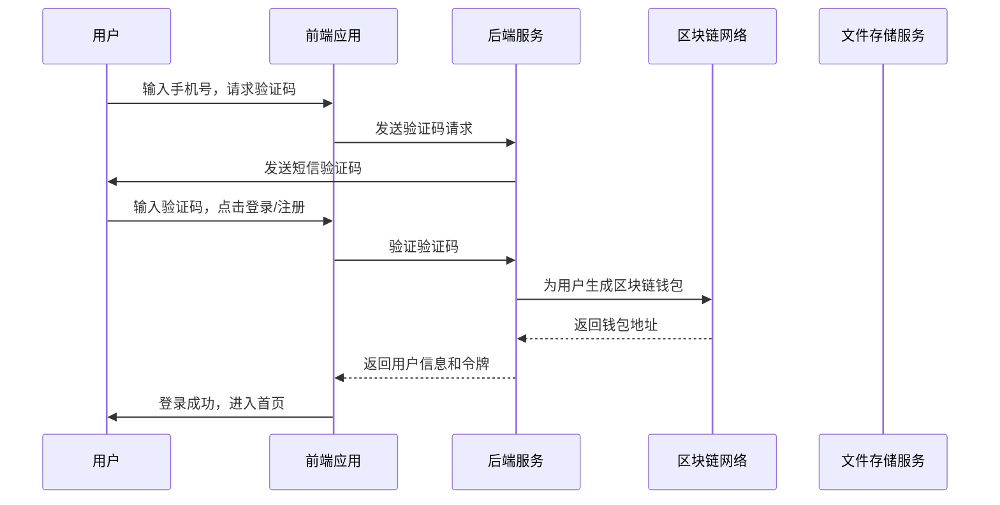
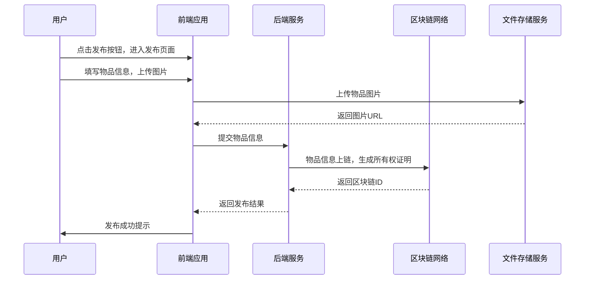
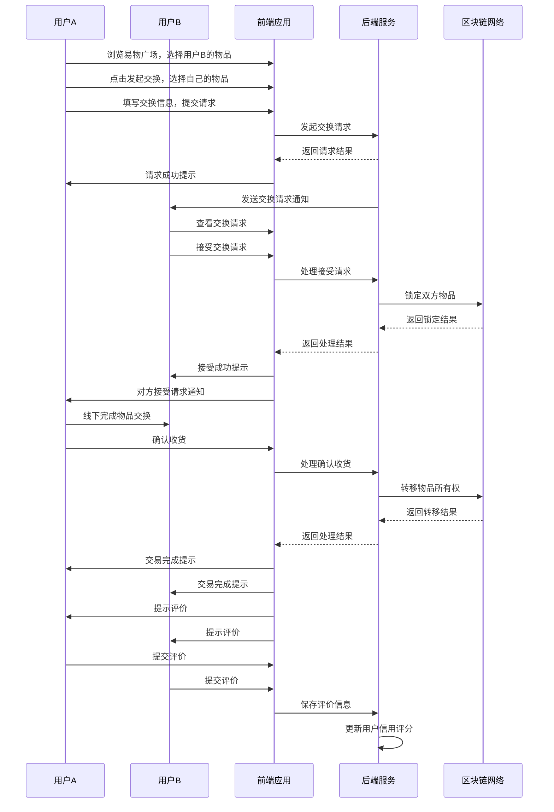
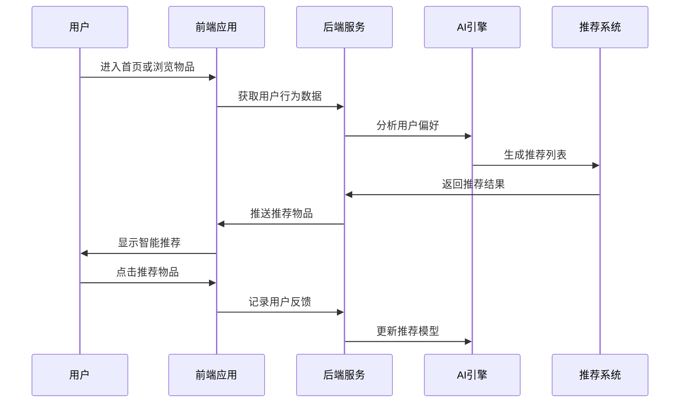
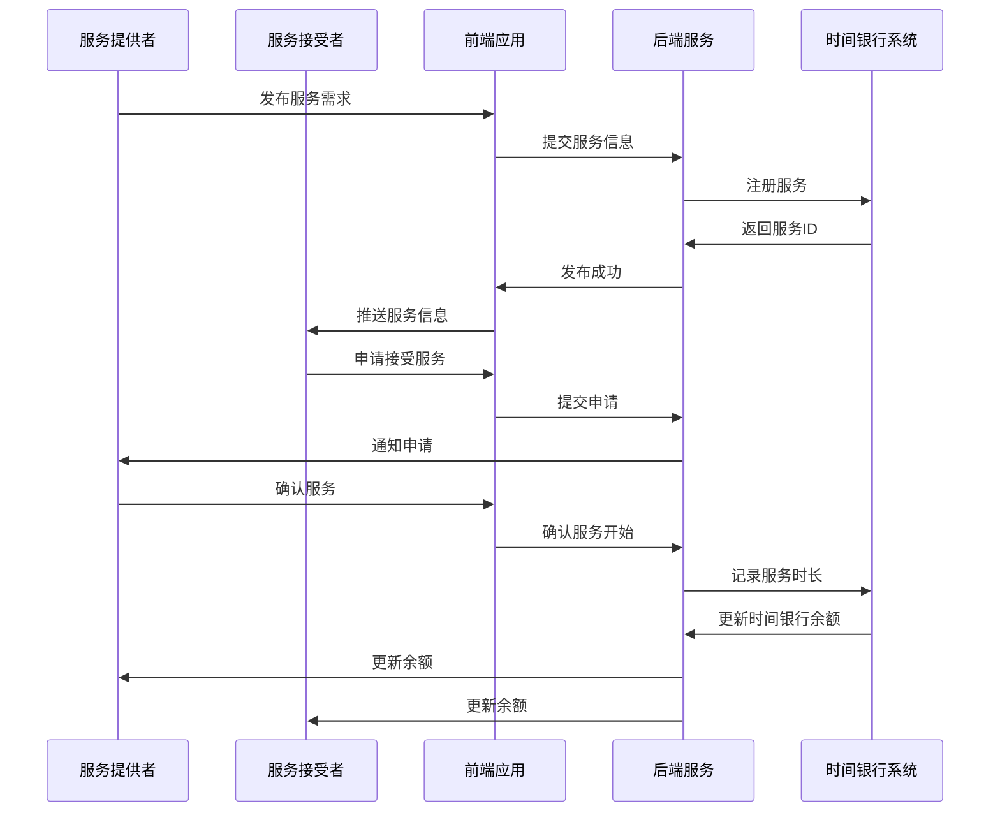

# 换物平台产品需求文档 (PRD)

## 1. 文档概述

### 1.1 项目背景
本项目是一个融合电商、以物换物与区块链技术的创新交易平台，核心理念是"人人自治共享共创"。平台利用区块链技术确保交易的安全性、透明性和可信度，同时提供便捷的以物换物和积分交易功能，主要服务于学生、宝妈、手工艺爱好者等群体。

### 1.2 核心价值主张
- **信任保障**：通过区块链技术实现物品所有权确权和交易记录不可篡改
- **便捷交易**：支持以物换物、积分换物、现金交易等多种交易方式
- **社区共建**：基于"人人自治共享共创"理念构建用户社区
- **环保理念**：促进物品循环利用，减少浪费
- **智能匹配**：AI驱动的个性化推荐系统

### 1.3 目标用户画像
- **学生群体**：宿舍空间有限，书籍、电子设备、生活用品流转需求大
- **宝妈群体**：儿童用品、玩具、衣物更新快，适合交换
- **手工艺爱好者**：手工制品分享、材料交换、技能交流
- **环保主义者**：倡导物品循环利用
- **社区居民**：促进邻里间物品共享

## 2. 产品目标

### 2.1 业务目标
1. 建立一个安全、透明的以物换物交易平台
2. 实现物品所有权的区块链确权
3. 支持多种交易模式（以物换物、积分换物、现金交易）
4. 构建用户信用体系，提升交易信任度
5. 提供便捷的用户操作界面和流畅的交易体验

### 2.2 产品目标
1. 用户增长：月活跃用户达到10万+
2. 交易活跃：日均交易笔数达到1000+
3. 用户留存：30日留存率达到60%+
4. 交易成功率：达到85%+
5. 用户满意度：NPS评分达到50+

### 2.3 技术目标
1. 系统可用性：99.9%
2. 页面加载时间：< 2秒
3. 交易处理时间：< 5秒
4. 并发用户数：支持10,000+同时在线

## 3. 用户角色定义

### 3.1 普通用户
- **角色描述**：平台主要使用者，进行物品发布、交换、租赁等操作
- **核心需求**：发布物品、浏览物品、发起交换、完成交易
- **权限范围**：注册登录、管理个人物品、发起交易、评价交易对手

### 3.2 平台管理员
- **角色描述**：平台运营人员，负责平台日常管理
- **核心需求**：管理用户、审核物品、处理纠纷、维护平台运营
- **权限范围**：用户管理、物品审核、交易监管、系统配置

### 3.3 监管机构
- **角色描述**：合规监管方，负责数据审计
- **核心需求**：合规审查、数据审计
- **权限范围**：访问链上交易数据、审查可疑交易

## 4. 核心功能模块

### 4.1 用户管理模块

#### 4.1.1 用户认证与注册
- **功能ID**: FM001
- **功能描述**：用户通过手机号+验证码进行注册和登录
- **业务流程**：
    1. 用户输入手机号，点击获取验证码
    2. 系统发送验证码到用户手机
    3. 用户输入验证码，点击登录/注册
    4. 系统验证验证码，创建/登录用户账户
    5. 系统为用户生成区块链钱包地址
- **界面设计**：
    - 登录页面：手机号输入框、验证码输入框、获取验证码按钮、登录/注册按钮
- **技术实现**：
    - API接口：`POST /tradex/client/auth/send-sms`、`POST /tradex/client/auth/login-or-register`
    - 区块链集成：用户注册时自动生成钱包地址

#### 4.1.2 个人资料管理
- **功能ID**: FM002
- **功能描述**：用户可以查看和编辑个人资料
- **业务流程**：
    1. 用户进入个人中心页面
    2. 点击编辑资料按钮
    3. 修改个人信息（昵称、性别、头像等）
    4. 点击保存按钮
    5. 系统更新用户信息
- **界面设计**：
    - 个人中心页面：显示用户信息、编辑资料按钮
    - 编辑资料页面：表单输入框、保存按钮
- **技术实现**：
    - API接口：`GET /tradex/client/user/get`、`POST /tradex/client/user/update`

### 4.2 物品管理模块

#### 4.2.1 物品发布
- **功能ID**: FM003
- **功能描述**：用户可以发布自己的闲置物品
- **业务流程**：
    1. 用户点击发布按钮，进入发布物品页面
    2. 填写物品信息（名称、类型、描述、图片、折旧程度等）
    3. 点击提交按钮
    4. 系统验证信息，生成物品唯一标识
    5. 系统将物品信息上链，生成所有权证明
- **界面设计**：
    - 发布物品页面：图片上传区域、基本信息表单（名称、类型、描述）、折旧程度滑块
- **技术实现**：
    - API接口：`POST /tradex/client/item/publish`
    - 区块链集成：物品信息上链，生成NFT或唯一哈希作为所有权证明
    - 文件存储：使用OSS存储物品图片

#### 4.2.2 物品生命周期管理
- **功能ID**: FM004
- **功能描述**：用户可以管理自己物品的生命周期，包括拥有、发起出让、审核中、审核不通过、可出让、交易中、已转让、已销毁等状态
- **业务流程**：
    1. 用户进入我的物品列表页面
    2. 查看所有物品及其当前状态
    3. 根据物品状态进行相应操作（发起转让、取消转让等）
- **界面设计**：
    - 我的物品列表页面：物品卡片列表，显示物品基本信息和当前状态
    - 物品详情页面：显示物品详细信息和操作按钮
- **技术实现**：
    - API接口：`POST /tradex/client/item/list-mine`、`POST /tradex/client/item/detail/{itemId}`
    - 状态管理：使用Vuex管理物品状态

### 4.3 交易管理模块

#### 4.3.1 发起转让
- **功能ID**: FM005
- **功能描述**：用户可以将状态为"拥有"的物品发起转让
- **业务流程**：
    1. 用户进入我的物品列表页面
    2. 选择状态为"拥有"的物品
    3. 点击"发起转让"按钮，进入转让页面
    4. 填写转让信息（期望交换物品、交换地点等）
    5. 点击提交按钮
    6. 系统审核物品信息，更新物品状态为"审核中"
- **界面设计**：
    - 转让页面：物品基本信息、期望交换物品输入框、交换地点选择器
- **技术实现**：
    - API接口：`POST /tradex/client/item/transfer`

#### 4.3.2 浏览可出让物品
- **功能ID**: FM006
- **功能描述**：用户可以查看和检索附近的可出让物品
- **业务流程**：
    1. 用户进入易物广场页面
    2. 系统显示附近的可出让物品列表
    3. 用户可以通过搜索、筛选、排序等方式查找物品
    4. 用户可以查看物品详情
- **界面设计**：
    - 易物广场页面：物品卡片列表，显示物品基本信息和距离
    - 搜索筛选栏：搜索框、筛选条件、排序选项
- **技术实现**：
    - API接口：`POST /tradex/client/square/list-item`
    - 定位服务：获取用户位置，计算物品距离

#### 4.3.3 发起交换请求
- **功能ID**: FM007
- **功能描述**：用户可以向其他用户的物品发起交换请求
- **业务流程**：
    1. 用户进入易物广场，查看物品列表
    2. 选择感兴趣的物品，进入物品详情页面
    3. 点击"发起交换"按钮，进入发起交换页面
    4. 选择自己要交换的物品
    5. 填写交换信息（交换地点、时间、联系方式等）
    6. 点击提交按钮
    7. 系统将交换请求发送给物品所有者
- **界面设计**：
    - 物品详情页面：物品信息、发起交换按钮
    - 发起交换页面：目标物品信息、可交换物品选择、交换信息表单
- **技术实现**：
    - API接口：`POST /tradex/client/trade/transfer-apply`

#### 4.3.4 处理交换请求
- **功能ID**: FM008
- **功能描述**：物品所有者可以接受或拒绝交换请求
- **业务流程**：
    1. 物品所有者收到交换请求通知
    2. 进入交易列表页面，查看交换请求
    3. 查看请求详情，包括请求方信息和交换物品
    4. 选择接受或拒绝交换请求
    5. 如果接受，系统更新交易状态为"交易中"
    6. 如果拒绝，系统记录拒绝原因，关闭交易
- **界面设计**：
    - 交易列表页面：交易卡片列表，显示交易状态
    - 交易详情页面：交易双方信息、交换物品信息、接受/拒绝按钮
- **技术实现**：
    - API接口：`POST /tradex/client/trade/accept-transfer-apply`、`POST /tradex/client/trade/reject-transfer-apply`
    - 智能合约：自动执行交易条款

#### 4.3.5 完成交易
- **功能ID**: FM009
- **功能描述**：交易双方在完成物品交换后确认交易完成
- **业务流程**：
    1. 交易双方线下完成物品交换
    2. 买方在平台上点击"确认收货"按钮
    3. 系统更新交易状态为"交易完成"
    4. 系统将物品所有权转移到买方名下
    5. 系统提示双方进行互评
- **界面设计**：
    - 交易详情页面：确认收货按钮
    - 评价页面：评分星级、评价内容输入框
- **技术实现**：
    - API接口：`POST /tradex/client/trade/completed`
    - 区块链集成：更新物品所有权记录

#### 4.3.6 交易评价
- **功能ID**: FM010
- **功能描述**：交易完成后，双方可以互相评价
- **业务流程**：
    1. 交易完成后，系统提示双方进行评价
    2. 用户进入评价页面，对交易对手进行评分和评价
    3. 点击提交按钮
    4. 系统记录评价信息，并更新用户信用评分
- **界面设计**：
    - 评价页面：评分星级（1-5星）、评价内容输入框
- **技术实现**：
    - API接口：`POST /tradex/client/trade/score`
    - 信用模型：结合评价信息更新用户信用评分

### 4.4 积分管理模块

#### 4.4.1 积分获取与使用
- **功能ID**: FM011
- **功能描述**：用户可以通过交易获得积分，也可以使用积分购买物品
- **业务流程**：
    1. 用户完成交易后获得相应积分
    2. 用户可以在积分换物区使用积分购买物品
    3. 系统扣除用户积分，完成交易
- **界面设计**：
    - 积分账户页面：显示积分余额、积分交易记录
    - 积分换物页面：积分商品列表
- **技术实现**：
    - API接口：`GET /tradex/client/user/points-account`、`POST /tradex/client/trade/create-pay`

## 5. 扩展功能模块

### 5.1 AI智能匹配推荐系统

#### 5.1.1 智能推荐
- **功能ID**: FM012
- **功能描述**：基于用户行为数据，智能推荐可能感兴趣的交换物品
- **业务流程**：
    1. 系统分析用户行为数据
    2. 识别用户偏好和需求
    3. 智能推荐相关物品
    4. 用户查看推荐结果
    5. 系统学习用户反馈优化推荐
- **界面设计**：
    - 推荐页面：个性化推荐物品列表
    - 智能筛选：基于AI的筛选条件
- **技术实现**：
    - API接口：`/client/recommendation/list` - 获取推荐物品列表
    - 机器学习：协同过滤算法、深度学习模型
    - 实体字段：`userPreferences`、`recommendationScore`、`matchReason`、`interactionHistory`

### 5.2 时间银行服务

#### 5.2.1 服务交换
- **功能ID**: FM013
- **功能描述**：用户通过提供服务换取他人服务，使用时间作为交换单位
- **业务流程**：
    1. 用户发布服务需求
    2. 其他用户查看并提供服务
    3. 服务完成后双方确认
    4. 系统记录服务时长
    5. 建立时间银行账户
- **界面设计**：
    - 服务发布页面：服务类型选择、时长设置
    - 服务市场页面：服务列表、时长显示
    - 时间银行页面：余额显示、历史记录
- **技术实现**：
    - API接口：`/client/service/publish`、`/client/service/accept`、`/client/service/complete`、`/client/service/time-bank`
    - 实体字段：`serviceType`、`serviceDuration`、`serviceProvider`、`timeBankBalance`

### 5.3 社区团购功能

#### 5.3.1 团购组织
- **功能ID**: FM014
- **功能描述**：用户参与社区团购，以更低价格获取物品
- **业务流程**：
    1. 用户发起团购
    2. 其他用户加入团购
    3. 达到最低人数后团购成功
    4. 统一采购分发
    5. 完成交易
- **界面设计**：
    - 团购发布页面：团购商品、目标人数设置
    - 团购详情页面：进度显示、参与人员
    - 团购列表页面：进行中、已完成团购
- **技术实现**：
    - API接口：`/client/group/publish`、`/client/group/join`、`/client/group/list`、`/client/group/complete`
    - 实体字段：`groupId`、`groupLeader`、`participants`、`minParticipants`、`groupStatus`

### 5.4 物品租赁功能

#### 5.4.1 短期租赁
- **功能ID**: FM015
- **功能描述**：用户短期租赁物品，满足临时需求
- **业务流程**：
    1. 用户发布租赁物品
    2. 其他用户查看租赁需求
    3. 确定租赁时间和费用
    4. 完成租赁交易
    5. 按时归还物品
- **界面设计**：
    - 租赁发布页面：物品信息、租金设置
    - 租赁市场页面：租赁物品列表、租金显示
    - 租赁详情页面：租赁条件、押金信息
- **技术实现**：
    - API接口：`/client/rental/publish`、`/client/rental/request`、`/client/rental/accept`、`/client/rental/return`
    - 实体字段：`rentalPeriod`、`rentalPrice`、`depositAmount`、`rentalStatus`、`returnDeadline`

### 5.5 技能交换平台

#### 5.5.1 技能教学
- **功能ID**: FM016
- **功能描述**：用户通过教授技能换取学习其他技能
- **业务流程**：
    1. 用户发布技能教学
    2. 其他用户申请学习
    3. 确定交换条件
    4. 完成技能交换
    5. 互相评价
- **界面设计**：
    - 技能发布页面：技能类型、教学方式设置
    - 技能市场页面：技能列表、难度等级
    - 技能详情页面：教学内容、交换条件
- **技术实现**：
    - API接口：`/client/skill/publish`、`/client/skill/learn`、`/client/skill/exchange`
    - 实体字段：`skillType`、`skillLevel`、`teachingMethod`、`exchangeRatio`、`skillRating`

### 5.6 环保积分激励系统

#### 5.6.1 环保激励
- **功能ID**: FM017
- **功能描述**：用户参与环保行为获得环保积分，兑换环保产品
- **业务流程**：
    1. 用户完成环保行为
    2. 系统自动计算环保积分
    3. 用户查看积分余额
    4. 兑换环保产品
    5. 分享环保成就
- **界面设计**：
    - 环保积分页面：积分余额、环保行为记录
    - 环保商城页面：环保产品列表
    - 环保排行榜：环保贡献排名
- **技术实现**：
    - API接口：`/client/eco/points`、`/client/eco/rewards`、`/client/eco/leaderboard`
    - 实体字段：`ecoPoints`、`ecoActions`、`ecoRanking`、`carbonReduction`、`ecoRewards`

### 5.7 信用评级系统

#### 5.7.1 信用评估
- **功能ID**: FM018
- **功能描述**：基于交易历史和用户评价建立信用评级系统
- **业务流程**：
    1. 系统收集交易数据
    2. 分析用户行为
    3. 计算信用评分
    4. 展示信用等级
    5. 基于信用提供服务
- **界面设计**：
    - 信用页面：信用评分、信用等级显示
    - 信用历史：交易记录、评价记录
    - 信用特权：基于信用的服务
- **技术实现**：
    - API接口：`/client/credit/score`、`/client/credit/history`
    - 实体字段：`creditScore`、`trustLevel`、`transactionHistory`、`disputeCount`、`complianceRate`

### 5.8 社区互助网络

#### 5.8.1 邻里互助
- **功能ID**: FM019
- **功能描述**：用户在紧急情况下快速找到附近邻居提供帮助
- **业务流程**：
    1. 用户发布求助信息
    2. 系统推送给附近用户
    3. 邻居响应求助
    4. 提供帮助
    5. 评价互助体验
- **界面设计**：
    - 求助发布页面：求助类型、紧急程度选择
    - 求助列表页面：附近求助信息
    - 互助记录：互助历史、感谢积分
- **技术实现**：
    - API接口：`/client/help/request`、`/client/help/response`、`/client/help/complete`
    - 实体字段：`helpType`、`emergencyLevel`、`locationRadius`、`helperId`、`gratitudePoints`

### 5.9 物品溯源系统

#### 5.9.1 物品追踪
- **功能ID**: FM020
- **功能描述**：用户查看物品的完整流转历史，确保来源可靠
- **业务流程**：
    1. 用户查看物品详情
    2. 系统显示物品流转历史
    3. 展示历任所有者
    4. 显示物品状态变化
    5. 提供防伪验证
- **界面设计**：
    - 物品溯源页面：流转历史、所有权变更
    - 验证信息：区块链验证结果
    - 防伪标识：真实性认证
- **技术实现**：
    - API接口：`/client/item/history/{itemId}`、`/client/item/verify/{itemId}`
    - 实体字段：`ownershipHistory`、`transferRecords`、`authenticity`、`blockchainPath`

### 5.10 社交圈子功能

#### 5.10.1 圈子社交
- **功能ID**: FM021
- **功能描述**：用户加入基于兴趣、地域、职业等标签的社交圈子
- **业务流程**：
    1. 用户创建或加入圈子
    2. 圈内发布物品
    3. 参与圈子活动
    4. 建立圈子关系
    5. 享受圈子特权
- **界面设计**：
    - 圈子列表页面：可加入圈子、已加入圈子
    - 圈子详情页面：成员列表、圈子动态
    - 圈子活动：圈子专属活动
- **技术实现**：
    - API接口：`/client/circle/create`、`/client/circle/join`、`/client/circle/feed`
    - 实体字段：`circleId`、`circleName`、`circleMembers`、`circleType`、`circleBenefits`

## 6. 详细业务流程

### 6.1 用户注册与认证流程

### 6.2 物品发布流程

### 6.3 以物换物交易流程

### 6.4 AI智能推荐流程

### 6.5 时间银行服务流程

## 7. 界面原型设计

### 7.1 首页设计

- **布局**：顶部搜索栏、轮播图、分类导航、物品列表
- **核心功能**：
    - 搜索物品
    - 浏览推荐物品
    - 进入易物广场
    - 查看通知
- **关键组件**：
    - 搜索框：支持关键词搜索
    - 物品卡片：显示物品图片、名称、距离、价格/积分

### 7.2 发布物品页面

- **布局**：图片上传区域、基本信息表单、折旧程度滑块、提交按钮
- **核心功能**：
    - 上传物品图片（最多5张）
    - 填写物品名称、类型、描述
    - 设置折旧程度（1-10成新）
    - 提交发布
- **关键组件**：
    - 图片上传器：支持多图上传和预览
    - 下拉选择框：选择物品类型
    - 滑块组件：设置折旧程度

### 7.3 易物广场页面

- **布局**：搜索筛选栏、物品列表
- **核心功能**：
    - 搜索物品
    - 按类型、距离、发布时间筛选
    - 查看物品详情
    - 发起交换
- **关键组件**：
    - 筛选面板：展开/收起筛选条件
    - 物品卡片列表：支持下拉加载更多
    - 距离指示器：显示物品与用户的距离

### 7.4 我的物品页面

- **布局**：状态筛选栏、物品列表
- **核心功能**：
    - 按状态筛选物品（拥有、审核中、可出让等）
    - 查看物品详情
    - 发起转让
    - 管理物品
- **关键组件**：
    - 状态标签：显示物品当前状态
    - 操作按钮：根据物品状态显示不同操作

### 7.5 交易详情页面

- **布局**：交易双方信息、交换物品信息、交易状态、操作按钮
- **核心功能**：
    - 查看交易详情
    - 接受/拒绝交换请求
    - 确认交易完成
    - 进行评价
- **关键组件**：
    - 交易状态指示器：显示当前交易阶段
    - 操作按钮组：根据交易状态显示不同操作

## 8. 技术实现要求

### 8.1 前端技术栈
- **框架**：Vue.js 3
- **状态管理**：Vuex
- **UI组件库**：Vant
- **HTTP客户端**：Axios
- **路由管理**：Vue Router
- **类型系统**：TypeScript

### 8.2 后端技术栈
- **API框架**：基于Java/Go的RESTful API
- **区块链平台**：支持智能合约的区块链（如Ethereum、BSC）
- **数据库**：MySQL + Redis
- **文件存储**：OSS

### 8.3 区块链技术实现

#### 8.3.1 双链结构
- **主链**：处理交易数据，采用高性能共识机制
- **侧链**：存储物品详情和交易日志，降低存储成本

#### 8.3.2 智能合约
- **功能**：
    - 物品所有权管理
    - 交易条款自动执行
    - 资金/物品锁定与释放
- **关键合约**：
    - 物品NFT合约：生成物品所有权证明
    - 交易执行合约：自动化交易流程

#### 8.3.3 隐私保护
- **零知识证明**：隐藏敏感信息，同时保证交易可验证
- **数据加密**：用户隐私信息加密存储

#### 8.3.4 跨链支付
- **支持**：ETH、BSC等多链资产
- **机制**：通过桥接技术实现多链资产兑换

### 8.4 核心API接口

#### 8.4.1 用户认证接口
- `POST /tradex/client/auth/send-sms`：发送验证码
- `POST /tradex/client/auth/login-or-register`：手机号+验证码登录/注册

#### 8.4.2 物品管理接口
- `POST /tradex/client/item/publish`：发布物品
- `POST /tradex/client/item/list-mine`：查询我的物品列表
- `POST /tradex/client/item/detail/{itemId}`：查询物品详情
- `POST /tradex/client/item/transfer`：发起物品转让

#### 8.4.3 交易管理接口
- `POST /tradex/client/trade/transfer-apply`：发起交换请求
- `POST /tradex/client/trade/accept-transfer-apply`：接受交换请求
- `POST /tradex/client/trade/reject-transfer-apply`：拒绝交换请求
- `POST /tradex/client/trade/completed`：确认交易完成
- `POST /tradex/client/trade/score`：交易评价

## 9. 非功能需求

### 9.1 性能要求
- 页面加载时间：< 2秒
- 交易处理时间：< 5秒
- 并发用户数：支持10,000+同时在线

### 9.2 安全性要求
- 数据加密：传输和存储加密
- 区块链安全：智能合约审计，防止漏洞
- 访问控制：基于角色的权限管理
- 防攻击：防止SQL注入、XSS等常见攻击

### 9.3 可用性要求
- 系统可用性：99.9%
- 容错机制：异常处理和系统恢复机制
- 数据备份：定期数据备份和恢复方案

### 9.4 可扩展性要求
- 模块化设计：支持功能扩展
- 微服务架构：便于服务独立部署和扩展
- 区块链扩展性：支持链上数据增长

## 10. 风险与依赖

### 10.1 技术风险
- **区块链性能瓶颈**：高并发场景下的交易处理能力
- **智能合约漏洞**：可能导致资产损失
- **跨链技术复杂性**：多链资产兑换的技术实现难度

### 10.2 业务风险
- **用户 adoption**：用户对区块链技术的接受度
- **监管政策**：区块链相关监管政策的不确定性
- **交易纠纷**：线下交易可能产生的纠纷处理

### 10.3 依赖关系
- **区块链网络**：依赖第三方区块链平台的稳定性
- **OSS服务**：依赖第三方文件存储服务
- **短信服务**：依赖第三方短信服务商

## 11. 项目实施计划

### 11.1 阶段划分
- **阶段一**：基础功能开发（用户注册、物品发布、浏览）
- **阶段二**：交易功能开发（发起转让、交换请求、交易执行）
- **阶段三**：区块链集成（物品确权、交易上链）
- **阶段四**：扩展功能开发（AI推荐、时间银行、团购等）
- **阶段五**：优化与测试（性能优化、安全测试、用户测试）
- **阶段六**：上线与运营（正式上线、用户运营、迭代优化）

### 11.2 关键里程碑
- 基础功能完成：第4周
- 交易功能完成：第8周
- 区块链集成完成：第12周
- 扩展功能完成：第16周
- 系统测试完成：第18周
- 正式上线：第20周

## 12. 验收标准

### 12.1 功能验收
- 所有核心功能实现并正常运行
- 区块链功能正确集成（物品确权、交易上链）
- 多种交易模式支持（以物换物、积分换物、现金交易）
- 扩展功能正常运行（AI推荐、时间银行、团购等）

### 12.2 性能验收
- 页面加载时间 < 2秒
- 交易处理时间 < 5秒
- 支持10,000+并发用户

### 12.3 安全验收
- 通过安全渗透测试
- 智能合约通过审计
- 数据加密符合安全标准

### 12.4 用户体验验收
- 用户界面友好直观
- 操作流程便捷顺畅
- 响应式设计，支持多设备访问

---

本PRD文档详细描述了换物平台的核心功能、业务流程、界面设计和技术实现要点，为项目开发提供了全面的指导和参考。文档涵盖了从基础功能到创新扩展功能的完整体系，确保产品能够满足目标用户的需求并实现业务目标。