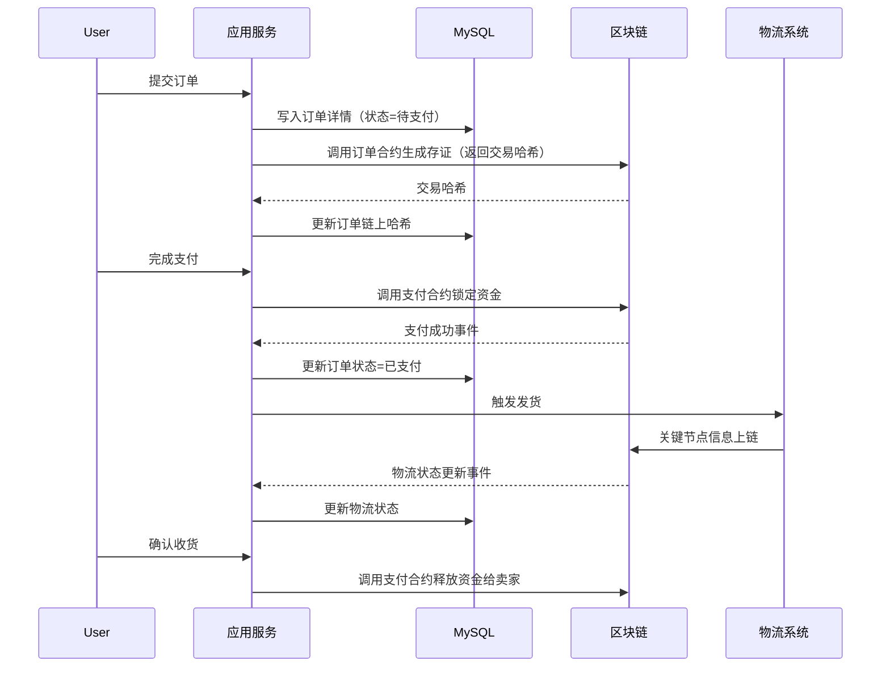

针对将区块链与关系型数据库结合的混合架构设计，以下是一个详细的系统设计方案，重点解决数据分界、交互逻辑和性能优化问题：

---

### 一、架构分层设计
#### 1. **整体架构图**
```
+-------------------+      +-------------------+
|   客户端 (Web/App)  | <--> |      接入层         |
+-------------------+      +-------------------+ 
                              | 负载均衡/API网关
                              ↓
+-------------------------------------------------+
|                  业务逻辑层                      |
|  - 用户服务       - 商品服务       - 支付服务      |
|  - 订单服务       - 物流服务       - 信用服务      |
+-------------------------------------------------+
       | 业务处理                 | 数据同步
       ↓                          ↓
+-------------------+      +-------------------+
| 关系型数据库 (MySQL) | <--> |  区块链中间件层      |
| (存储高频交易数据)   |      | (数据上链/智能合约调用) |
+-------------------+      +-------------------+
                              |
                              ↓
                   +-----------------------+
                   |   区块链网络            |
                   | (存储核心可信数据)       |
                   +-----------------------+
```

---

### 二、数据存储划分与交互逻辑
#### 1. **区块链存储范围**（不可篡改、需审计的核心数据）
| 数据类型            | 存储内容示例                     | 技术实现方式                |
|---------------------|--------------------------------|---------------------------|
| **平台代币交易记录** | 代币转账、质押、销毁记录         | ERC-20/ERC-721智能合约     |
| **商品所有权证明**   | 商品的NFT哈希、所有权变更记录    | 商品合约（链上NFT铸造）     |
| **用户关键身份**     | 钱包地址、信用评分哈希           | 用户合约（地址绑定信用值）  |
| **订单状态与合约**   | 订单ID、支付状态、智能合约地址   | 订单合约（自动执行条款）    |

#### 2. **关系型数据库存储范围**（高频操作、复杂查询数据）
| 数据类型            | 存储内容示例                     | 数据库设计建议              |
|---------------------|--------------------------------|---------------------------|
| **商品详情**         | 商品描述、图片URL、分类标签      | MySQL JSON字段存储扩展属性  |
| **用户个人信息**     | 姓名、联系方式、地址（加密存储）  | 敏感字段AES加密             |
| **订单详情**         | 商品列表、物流单号、历史状态      | 分库分表（按用户ID哈希）     |
| **物流跟踪数据**     | GPS坐标、承运商实时更新数据       | 时序数据库（如InfluxDB）    |
| **评价与争议内容**   | 文字评价、图片证据               | 全文检索优化（Elasticsearch）|

#### 3. **数据同步机制**
- **事件驱动同步**：
  - 当关系型数据库发生关键操作（如订单创建、支付完成）时，通过**消息队列（如Kafka）**触发异步上链。
  - 示例流程：
    ```mermaid
    graph LR
    A[用户下单] --> B[MySQL写入订单详情]
    B --> C[发送"订单创建"事件到Kafka]
    C --> D[区块链中间件消费事件]
    D --> E[调用智能合约生成订单存证]
    E --> F[将链上交易哈希回写MySQL]
    ```
- **双向验证**：
  - 链上关键数据（如订单状态）变更后，通过**区块链事件监听**同步到数据库。
  - 使用**预言机（Oracle）**将链下数据（如物流签收）反馈至智能合约。

---

### 三、智能合约与业务逻辑结合
#### 1. **核心合约设计**
| 合约类型         | 功能要点                              | 与数据库的交互逻辑              |
|------------------|-------------------------------------|-------------------------------|
| **支付合约**     | 托管资金、自动释放                   | 监听数据库支付状态，触发链上转账 |
| **信用合约**     | 根据链上交易更新用户信用评分          | 数据库信用分与链上哈希定期比对   |
| **仲裁合约**     | DAO投票或自动裁决争议                | 从数据库加载争议证据（哈希校验） |

#### 2. **典型业务流程示例：商品交易**


---

### 四、隐私与安全设计
#### 1. **数据隔离方案**
| 场景                | 方案                                |
|---------------------|-----------------------------------|
| **用户隐私数据**     | 数据库敏感字段加密存储（如AES-256） |
| **链上地址关联**     | 允许用户生成多个匿名子地址          |
| **合规审查**         | 监管机构通过密钥访问特定链上交易     |

#### 2. **区块链隐私增强**
- **零知识证明（ZKP）**：用户信用评分更新时，仅向链上提交证明而非原始数据。
- **混合存储策略**：将订单哈希的Merkle Root上链，明细数据存数据库（可通过Root验证完整性）。

---

### 五、性能优化策略
#### 1. **区块链层优化**
| 问题                | 解决方案                          |
|---------------------|---------------------------------|
| 交易吞吐量低         | 采用侧链（如Polygon）处理高频操作 |
| Gas费用波动          | 平台代币补贴+批量交易合并         |
| 数据查询延迟         | 建立链上数据的缓存索引（如The Graph）|

#### 2. **数据库层优化**
- **读写分离**：交易库（高并发写）与分析库（复杂查询）分离。
- **热点数据缓存**：使用Redis缓存用户信用分、商品库存等高频访问数据。
- **分库分表**：按用户ID哈希分片，避免单表过大。

---

### 六、部署架构建议
```
                            +-----------------+
                            |   AWS/GCP/Ali云  |
                            +-----------------+
                            |                 |
+-------------+    +------------------+    +------------------+
| 前端CDN     | ←→ | API网关 + 负载均衡 | ←→ | 业务服务集群       |
+-------------+    +------------------+    +------------------+
                                      |        |           |
                                      ↓        ↓           ↓
                           +----------+--------+-----------+
                           | 关系型数据库集群                |
                           | (MySQL + Redis + Elasticsearch)|
                           +---------------------------------+
                                      |
                                      ↓
                           +-----------------------+
                           | 区块链中间件            |
                           | (Kafka + 智能合约SDK)   |
                           +-----------------------+
                                      |
                                      ↓
                           +-----------------------+
                           | 区块链节点集群           |
                           | (主链 + 侧链/Layer2)     |
                           +-----------------------+
```

---

### 七、关键挑战与应对
1. **数据一致性**：
   - 采用**最终一致性**模型，通过异步补偿机制处理异常（如链上交易失败时回滚数据库）。
2. **监管合规**：
   - 设计**监管沙盒**接口，允许监管机构通过密钥访问链上数据，同时满足GDPR等法规。
3. **开发者体验**：
   - 提供**统一API网关**，封装区块链复杂性（如钱包管理、Gas估算），降低业务开发门槛。

---

通过以上设计，系统将实现：
- **可信性**：关键数据通过区块链防篡改，增强用户信任。
- **高性能**：90%的高频操作由数据库处理，TPS可达10,000+。
- **灵活性**：支持动态扩展（如新增区块链网络或分库分片）。